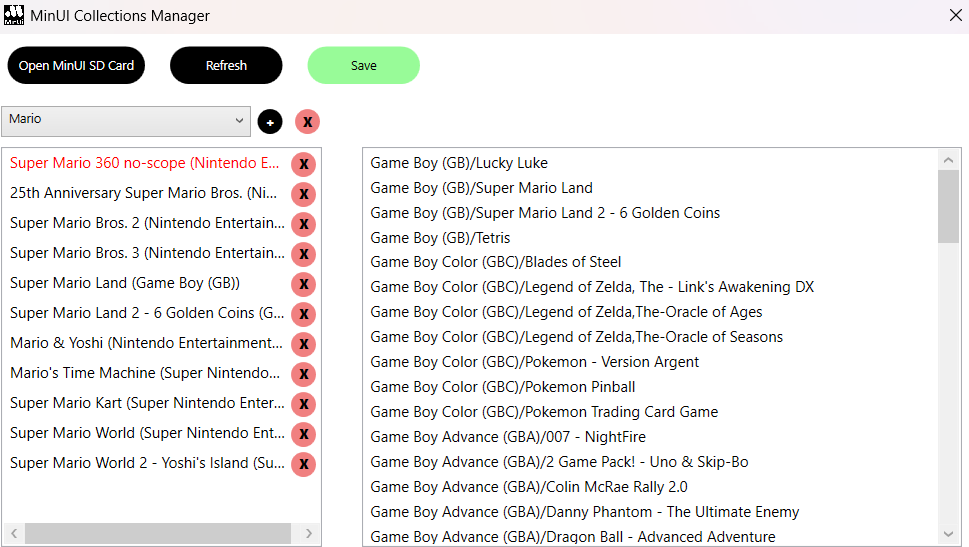

<h1 align="center">MinUI Collections Manager</h1>

    Effortlessly manage your MinUI game collections!

## Getting Started

🚀 Download the latest version [here](https://github.com/Fabuloup/MinUI-Collections-Manager/releases/latest)!

### Usage

1. Click the "Open MinUI SD Card" button.
    
2. Select your SD card in the file explorer.
3. Create a new collection by clicking the "+" button next to the dropdown menu.
    
    1. Enter the desired name for your collection in the popup window.
4. Add games to a collection by dragging them from the list on the right into the collection's list.
5. Delete a collection using the "X" button.
6. Switch between collections using the dropdown menu.
7. Save your changes by clicking the save button; unsaved changes will be discarded.
    1. Games displayed in red within a collection are missing and will be removed from the collection when this action is performed.